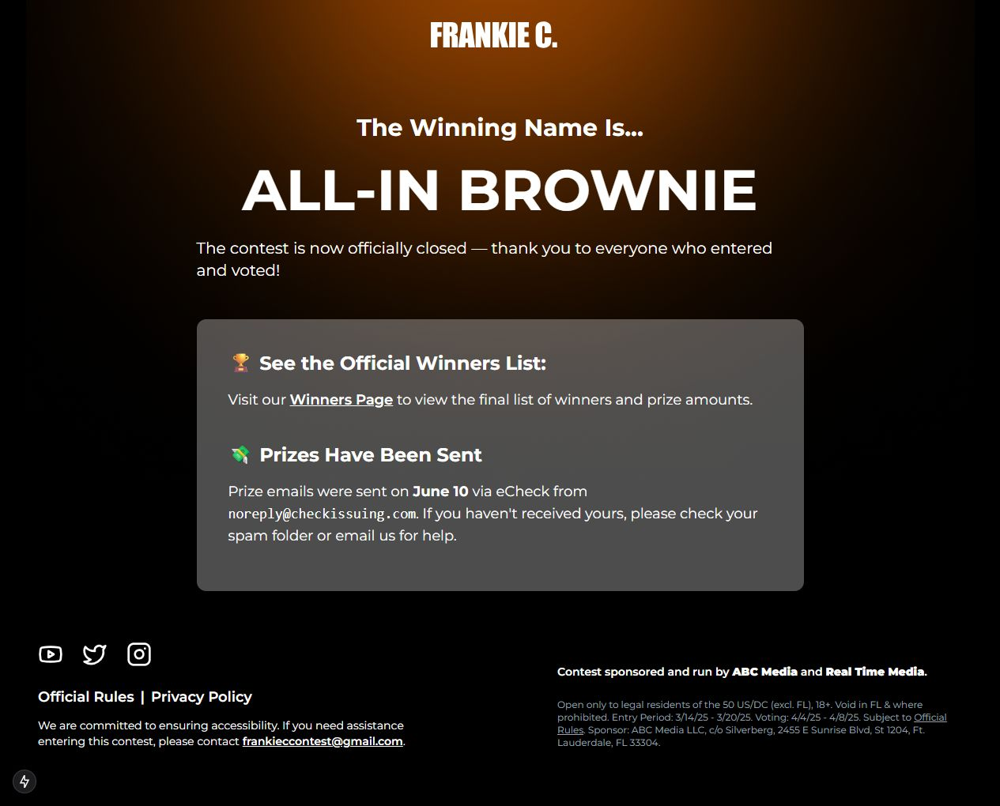
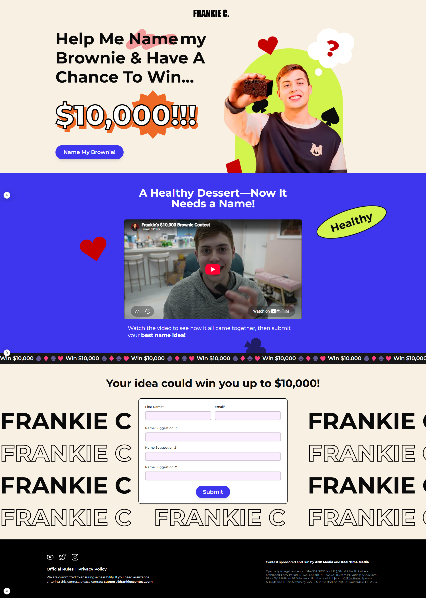

# Frankie C Brownie Naming Competition

A responsive campaign site for Frankie C's US$10,000 All-In Brownie naming competition.

The project supported the campaign from launch and entry collection through its post-campaign results and winner updates.



## Project context

Frankie invited his audience to name the brownie. The US$10,000 prize was split among the entrants who submitted the selected name.

I developed the responsive campaign experience, integrated the supplied brand and campaign assets, embedded the Jotform entry flow, and implemented the supporting rules, privacy, accessibility, voting, and results pages. Jotform and the campaign partners handled submission collection and entrant data.

The default branch reflects the post-campaign version. The original launch implementation remains available in the repository history.

## Original entry experience

<details>
<summary>View the full competition page from March 2025</summary>



</details>

## Features

- Responsive campaign and results pages
- Embedded Jotform entry collection
- Official rules and privacy pages
- Accessibility information and cookie consent
- Post-campaign winner updates
- Vercel Analytics integration

## Stack

- Next.js 15
- React 19
- Tailwind CSS
- Jotform
- Vercel Analytics

## Local development

```bash
npm install
npm run dev
```

Then open [http://localhost:3000](http://localhost:3000).

There is no public demo because this was a time-limited campaign. The embedded Jotform may no longer accept submissions.

## Case study

See the broader launch and ecommerce work in the [All-In Brownie case study](https://wesleyting.com/projects/all-in-brownie.html).

Brand and campaign assets belong to their respective owners and are shown here for project documentation.
